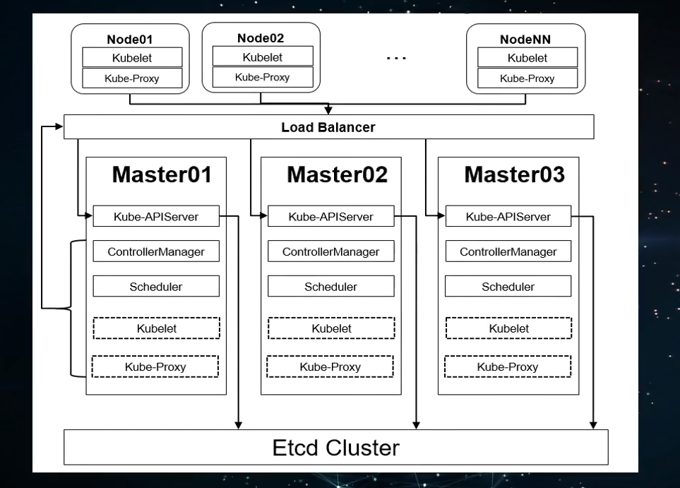

# kuberadm VS 二进制  生产上使用二进制， 恢复更快

## 1  基本环境配置

### 1.1 临时容器


### 1.2 Sidecar


### 1.3 Volume


### 1.4 ConfigMap 和 Secret





2基本组件安装


```shell
# 生成etcd服务端 CA证书
cd /etc/etcd/pki/
openssl genrsa -out etcd_server.key 2048
openssl req -new -key etcd_server.key -config etcd_ssl.cnf -subj "/CN=etcd-server" -out etcd_server.csr
openssl x509 -req -in etcd_server.csr -CA /etc/etcd/pki/ca.crt -CAkey /etc/etcd/pki/ca.key -CAcreateserial -days 36500 -extensions v3_req -extfile etcd_ssl.cnf -out etcd_server.crt
```

```shell
# 生成etcd客户端 CA证书
openssl genrsa -out etcd_client.key 2048
openssl req -new -key etcd_client.key -config etcd_ssl.cnf -subj "/CN=etcd-client" -out etcd_client.csr
openssl x509 -req -in etcd_client.csr -CA /etc/etcd/pki/ca.crt -CAkey /etc/etcd/pki/ca.key -CAcreateserial -days 36500 -extensions v3_req -extfile etcd_ssl.cnf -out etcd_client.crt
```

```shell
###启动etcd
systemctl restart etcd && systemctl enable etcd
### 查看日志
journalctl -xe -u etcd

```

```shell
etcdctl --cacert=/etc/kubernetes/pki/ca.crt --cert=/etc/etcd/pki/etcd_client.crt --key=/etc/etcd/pki/etcd_client.key --endpoints=https://192.168.137.110:2379,https://192.168.137.120:2379,https://192.168.137.130:2379 endpoint health
```

```shell
#生成kube-apiserver服务端CA证书
openssl genrsa -out apiserver.key 2048
openssl req -new -key apiserver.key -config master_ssl.cnf -subj "/CN=192.168.137.120" -out apiserver.csr
openssl x509 -req -in apiserver.csr -CA /etc/kubernetes/pki/ca.crt -CAkey /etc/kubernetes/pki/ca.key -CAcreateserial -days 36500 -extensions v3_req -extfile master_ssl.cnf -out apiserver.crt
```
```shell
#启动服务
systemctl start kube-apiserver && systemctl enable kube-apiserver
```

```shell
#生成kube客户端CA证书
openssl genrsa -out client.key 2048
openssl req -new -key client.key -config master_ssl.cnf -subj "/CN=admin" -out client.csr
openssl x509 -req -in client.csr -CA /etc/kubernetes/pki/ca.crt -CAkey /etc/kubernetes/pki/ca.key -CAcreateserial -days 36500 -extensions v3_req -extfile master_ssl.cnf -out client.crt
```
3高可用组件

