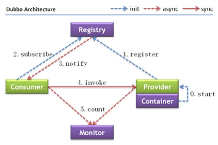
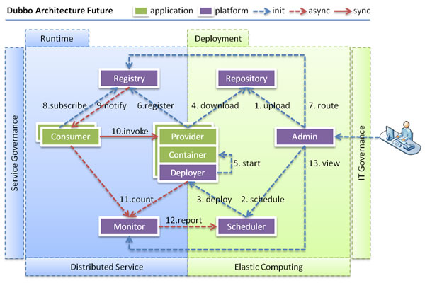

# 总体架构

## 节点角色说明:
 Registry 服务注册与发现的注册中心
 Consumer 调用远程服务的服务消费方

 Provider 暴露服务的服务提供方

 Monitor 统计服务的调用次数和调用时间的监控中心

 Container 服务运行容器

## Dubbo架构特点: 连通性、健壮性、伸缩性、以及向未来架构的升级性

### 连通性

>- 注册中心负责服务地址的注册与查找，相当于目录服务，服务提供者和消费者只在启动时与注册中心交互
注册中心不转发请求
>- 监控中心负责统计各服务调用次数，调用时间等，统计先在内存汇总后每分钟一次发送到监控中心服务器，并以表展示
>- 服务提供者向注册中心注册其提供的服务，并汇报调用时间到监控中心，此时间不包含网络开销
>- 服务消费者向注册中心获取服务提供者地址列表，并根据负载均衡算法直接调用提供者，同时汇报调用时间到监控中心，此时间包含网络开销
>- 注册中心、服务提供者、服务消费者三者之间均为长连接，监控中心除外
>- 注册中心通过长连接感知服务提供者的存在，服务提供者宕机，注册中心将立即推送时间通知消费者
>- 注册中心和监控中心全部宕机，不影响已运行的提供者和消费者，消费者在本地缓存了提供者列表
>- 注册中心和监控中心都是可选的，消费服务者可以直接连接服务提供者

### 健壮性

>- 监控中心宕机不影响使用，只是丢失部分采样数据
>- 数据库宕机后，注册中心仍能通过缓存提供服务列表查询，但不能提供注册新服务
>- 注册中心对等集群，任意一台宕机后，将自动切换到另一台
>- 注册中心全部宕机后，服务提供者和服务消费者仍能通过本地缓存通讯
>- 服务提供者无状态，任意一台宕机后，不影响使用
>- 服务提供者全部宕掉后，服务消费者应用将无法使用，并无限次重连等待服务提供者恢复

### 伸缩性

>- 注册中心为对等集群，可动态增加机器部署实例，所有客户端将自动发现新的注册中心
>- 服务提供者无状态，可动态增加机器部署实例，注册中心将推送新的服务提供者信息给消费者

### 升级性

当服务集群规模进一步扩大，带动IT治理结构进一步升级，需要实现动态部署，进行流动计算，现有分布式服务架构不会带来阻力。下图是未来可能的一种架构：
> 
>
#### 节点角色说明
Deployer 自动部署服务的本地代理

Repository 仓库用于存储服务应用发布包

Scheduler 调度中心基于访问压力自动增减服务提供者

Admin 统一管理控制台

Registry 服务注册与发现的注册中心

Monitor 统计服务的调用次数和调用时间的监控中心